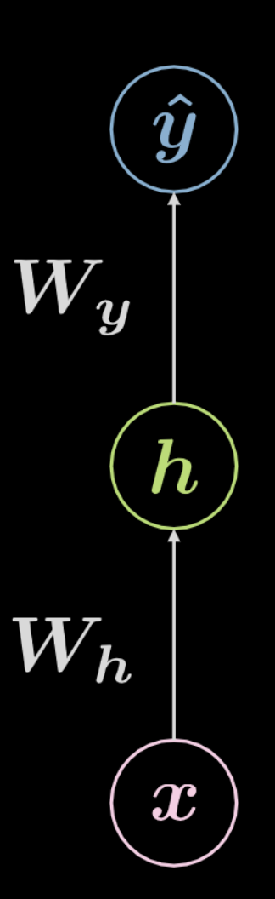

# Backpropagation
[Material](https://atcold.github.io/pytorch-Deep-Learning/en/week02/02/)

[Video](https://www.youtube.com/watch?v=d9vdh3b787Y&list=PLLHTzKZzVU9eaEyErdV26ikyolxOsz6mq&index=3)
## Modelos parametrizados
$\hat y=G(x,w)$

Donde $x$ es la entrada y $w$ son los *parámetros* del modelo
- Generalmente $w$ es implícito (no se usa como entrada al modelo, es un parámetro interno)
- Ej. Regresión lineal: $\hat y=\sum_i w_ix_i$

## Gradient descent
Da una diferencia entre $y$ (valor esperado) y $\hat y$ (valor obtenido en $G$)

Para minimizar (obtener los valores de $w$ que minimizan el costo): ***Gradient descent***
$$w\leftarrow w - \eta \nabla C$$
- Donde: 
    - $w$ son los parámetros de $\hat y$
    - $C$ es la función costo
    - $\nabla C$ es el gradiente de la función costo $C$ en función de los parámetros $w$
    - $\eta$ es la tasa de aprendizaje.
- Puede ser
    - Batch GD
    - Stochastic GD
    - Mini-batch GD
- Solo usado para funciones $G$ diferenciables.
    - Otros métodos de optimización se usan para funciones no diferenciables.

## Redes neuronales
- Unión de capas "función lineal - función no lineal"
- Generalmente función lineal es weighted sum y función no lineal es sencilla (tanh, relu)
- Gradiente se calcula con *Backpropagation* (Regla de la cadena)
    - En forma matricial: Jacobiano
    - Para *Autograd* (pytorch, tf) se utilizan grafos (con multiplicaciones matriciales) construidos para calcular automáticamente el gradiente de las redes.
        - Se pueden usar grafos para hallar derividas de cualquier función representable como un grafo acíclico dirigido (DAG)
- Bloques lineales (capa $k$): $s_{k+1}=w_kx_k$ (en forma matricial)
- Bloques no lineales: $z_k$=$h(s_k)$

### Backprop en la práctica
- Se usa ReLU (en vez de tanh o sigmoid). Principalmnete para para redes con muchas capas.
    - Debido a que es scale-invariant
- Función de costo es cross-entropy (con logsoftmax o similar NO SOFTMAX)
- Mini-batch gradient descent en el entrenamiento
    - Optimizador Adam con momento
    - Barajar las muestras de entrenamiento
    - Cada batch **debe** tener varias categorías
- Normalizar el set de entrenamiento
- La tasa de aprendizaje disminuye progresivamente
- Regularización L1 y L2 un poco en las funciones lineales (y solo después de algunos epochs)
    - No siempre
- Usar dropout
- Trucos de inicialización de pesos
- Generalmente las capas intermedias tienen muchas capas (para clasificación)
- El desempeño de una capa con $n$ nodos es *similar* al de $m$ capas con $\sqrt[m]{n}$ nodos
- **(Mucho más en "Neural Networks, Tricks of the Trade (2012) o Efficient Backprop (1998))**

## Entrenamiento de redes neuronales
- Siendo:
    - $n$: número de *features*
    - $m$: número de muestras
    - $K$: número de clases

Elementos:
- El set de *features*:
$$X=\begin{bmatrix} -x^{(1)}- \\ -x^{(2)}- \\ ...\\-x^{(m)}- \end{bmatrix}$$
Con dimensiones $n \times m$

- El set objetivo:
    - Representación ordenada $$c=\begin{bmatrix} c_1 \\ c_2 \\ ...\\c_m \end{bmatrix}$$
    - Representación one-hot
    $$c=\begin{bmatrix} c_1 & 0 & ...&0 \\ 0 & c_2 &...& 0\\ ... & ...&...&0\\0 & 0 & 0&c_m \end{bmatrix}$$
    - Entonces:
    $$y=\begin{bmatrix} -y^{(1)}- \\ -y^{(2)}- \\ ...\\-y^{(m)}- \end{bmatrix}$$
Con dimensiones $m\times K$

- Para una red *fully connected*
    - Capa de entrada ($a^{(1)}$) -> capa oculta ($a^{(2)}$)-> capa de salida($a^{(L)}$)

$$h=f(Wh\cdot x+b_h)$$
$$\hat y=g(Wy\cdot h+b_y)$$
Donde $f$ y $g$ son funciones no lineales (ReLU, tanh, $\sigma$, softmax, etc...)
- Con una capa final usando *softmax* y una función de pérdida *cross-entropy* (también llamado *log-likelihood* negativo):
$$L(\hat y,c)=\frac{1}{m}\sum_{i=1}^m{l(\hat y_i,c_i)}$$
$$l=-\log{(\hat y[c])}$$

- Se hace backpropagation (regla de la cadena) para hallar $\nabla W_y$, $\nabla W_h$:
$$J(W)=L(\hat y,y)$$
$$\frac{\partial J(W)}{\partial W_y}=\frac{\partial J(W)}{\partial \hat y}\frac{\partial \hat y}{\partial W_y}$$
$$\frac{\partial J(W)}{\partial W_h}=\frac{\partial J(W)}{\partial \hat y}\frac{\partial \hat y}{\partial h}\frac{\partial h}{\partial W_h}$$
- Se hace *gradient descent* para actualizar los pesos de cada capa:
$$W_h \leftarrow W_h-\eta \frac{\partial J(W)}{\partial W_h}$$
$$W_y \leftarrow W_y-\eta \frac{\partial J(W)}{\partial W_y}$$

---
Ver cuadernos de 04. spiral classification.ipynb y 05. regression.ipynb del repo para ejemplos de entrenar redes