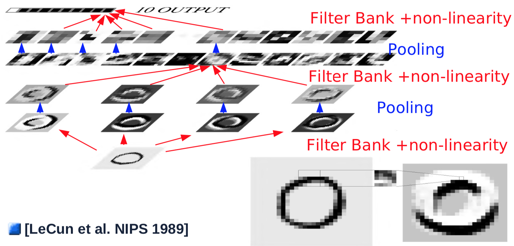
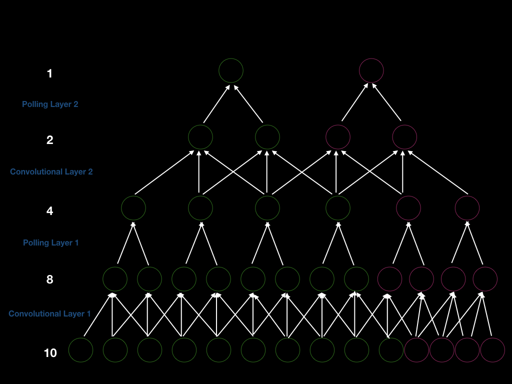

# Convolutional Neural Networks
[Material](https://atcold.github.io/pytorch-Deep-Learning/en/week03/03/)

[Video](https://www.youtube.com/watch?v=FW5gFiJb-ig&list=PLLHTzKZzVU9eaEyErdV26ikyolxOsz6mq&index=6)

## Transformación de parámetros
- Si para una función $G(x,w)$, $w$ son sus parámetros y $w=H(u)$, es posible calcular $u$ con backpropagation.
    - Ejemplos:
        - *weight sharing* $\rightarrow w_1=w_2=u_1 \quad\&\quad w_3=w_4=u_2$
            - Usado en CNNs / detección de patrones repetitivos - *motifs* (por ejemplo: reconocer una forma en una imagen sin importar su posición)
        - *hypernetworks* $\rightarrow$ los pesos de una red son calculados a partir de la salida de otra red
            - Utilizado en casos que $\hat y$ sea una transformación de $x$ ($w$ son los parámetros de la transformación)

## Convolución discreta
Deslizar una función (kernel) sobre otra función y hallar la suma de sus productos en todo momento.

- Definición:
$$y_i=\sum_jw_jx_{(i-j})$$
- En la práctica (*cross-correlation*)
$$y_i=\sum_jw_jx_{(i+j)}$$
- En 2D
$$y_i=\sum_{kl}w_{kl}x_{(i+k,j+l)}$$

- Otros conceptos
    - Padding
    - Stride: tamaño de los pasos de cada paso de la convolución
    - Kernel shape / Kernel size: no siempre es cuadrado, puede tener diferentes tamaños

## Convolutional Neural Networks
- Primeras redes convolucionales: MNIST (Lecun 1989)
    - Shared weights
    - Avg. Pooling + Subsampling
    - Stride
    - Kernel 5x5

- Aprende representaciones **jerárquicas** en el entrenamiento
    - Primeras capas -> características de bajo nivel (rayas, bolas)
    - Siguientes capas -> características de alto nivel (formas cada vez más complejas, uniones de características sencillas)
- Arquitectura
    - Capas convolucionales
        - Normalización (Batch norm, ...)
            - Puede ir antes de pooling también
        - Filtro (Convolución)
        - No-linealidad (ReLU, Tanh, ...)
        - Pooling (Max. Pooling, Norma $L_p$)
            - Usados con stride principalmente en las primeras capas
    - Clasificador
        - Varias capas fully connected (se pueden entender como convoluciones de tamaño1 también)
    - Otras capas útiles:
        - *Residual bypass connection*
            - resnet

## Propiedades de las señales naturales
- Las señales pueden ser representadas como vectores
    - Valores de los pixeles 
    - Amplitudes de las formas de onda en el tiempo
- Propiedades
    - Estacionalidad: La correlación cruzada de muchas señales es periódica y es grande para valores cercanos a 0, $T$, $2T$, ...
        - "El mismo patrón aparece múltiples veces en la misma señal"
        - Conduce a la capacidad de compartir parámetros (*weight sharing*): Se asume que las relaciones son periódicas.
            - Mejora: 
                - Convergencia (menos parámetros)
                - Generalización (patrón se puede repetir a lo largo de la señal)
                - No restringe al tamaño de la entrada (el patrón puede estar en cualquier lugar de la señal)
                - Paralelizable (cada parámetro puede ser entrenado de manerja individual)
    - Localidad: Información similar generalmente está agrupada localmente en regiones específicas
        - Conduce a escasez (*sparsity*): Para entender qué hay en una región de la señal, no es necesario ver qué hay lejos de ella.
            - Mejora: necesita menos parámetros $\rightarrow$ computación más rápida.
    - Composicionalidad: Las señales están hechas de *cosas pequeñas* (de manera jerárquida)

## Usos de las redes convolucionales
- Señales multidimensionales
- Señales con alta correlación local
- Señales en las que sus características pueden aparecer en cualquier punto dentro de su espacio
- 2D CNNs:
    - Detección de objetos
    - Localización
    - Reconocimiento
- 3D CNNs:
    - Imágenes biomédicas
    - Video
    - Imágenes multiespectrales
- Solo es buena idea si las señales de entrada cumplen con propiedades de localidad, estacionalidad y composicionalidad.
    - Siempre que se usen CNNs, validar esto!

## Álgebra lineal
La primera parte de [este video](https://www.youtube.com/watch?v=OrBEon3VlQg&list=PLLHTzKZzVU9eaEyErdV26ikyolxOsz6mq&index=7) tiene una muy buena explicación del álgebra detrás de las multiplicaciones de matrices para deep learning y convoluciones.