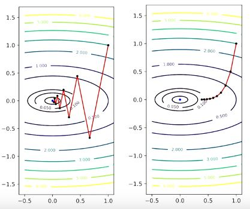
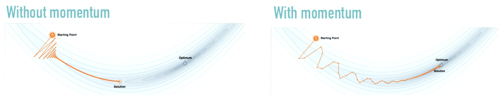
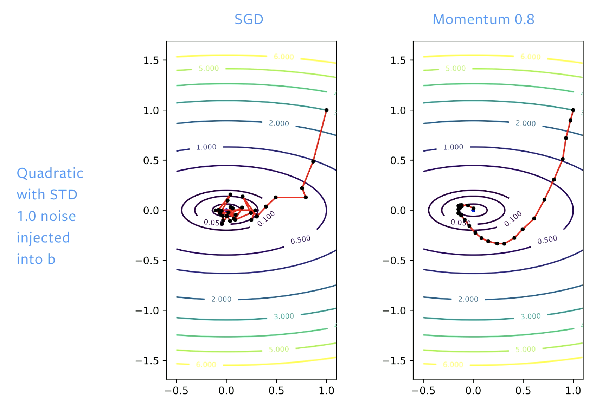
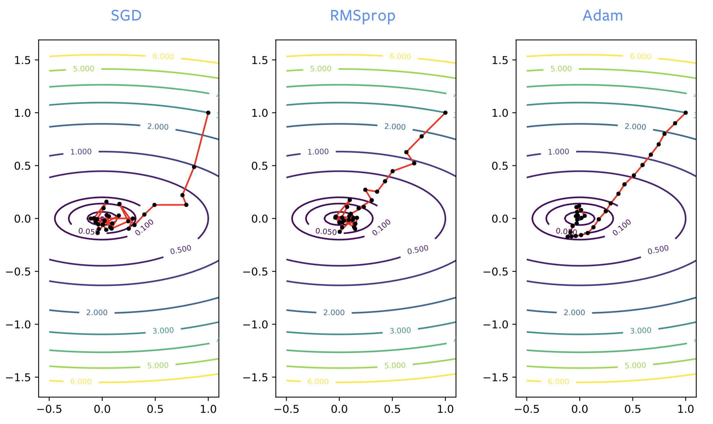

# Optimización
[Material](https://atcold.github.io/pytorch-Deep-Learning/en/week05/05/) 
[Video](https://www.youtube.com/watch?v=--NZb480zlg&list=PLLHTzKZzVU9eaEyErdV26ikyolxOsz6mq&index=8&t=5s)
## Técnicas de optimización
"¿Cómo minimizar el error de mi sistema?"
### *Gradient Descent* (GD)
- Método base
- **No es utilizado en redes neuronales**
- Optimiza $w$ para minimizar $f(w)$
- Se utilizan todas las muestras de entrenamiento en cada paso de optimización (*Full batch*)
- $w_{k+1}=w_k-\gamma_k\nabla f(w_k)$
    - Observa la dirección que maximiza el gradiente y da un paso en esa dirección (negativa)
    - Solo conoce información local (porque toma el máximo gradiente en un punto específico)
- En la práctica se utilizan $\gamma$ grandes ($\gamma_{opt}<\gamma<2\gamma_{opt}$), porque no se conoce el $\gamma$ óptimo.

- Si es necesario usar *Full-batch*, es mejor utilizar LBFGS o *Conjugate Gradientes* y no GD Vainilla.
### *Stochastic / Mini-batch Gradient Descent* (SGD)
- Ahora $f_i$ es la función costo de una única (o pocas en *mini-batch*) muestra.
- $w_{k+1}=w_k-\gamma_k\nabla f_i(w_k)$
- En promedio, usar SGD se aproxima a la solución óptima dada por GD.
- Más rápido de procesar que GD
    - Permite paralelización
- El muestreo debe ser aleatorio y uniforme (puede ser con o sin reemplazo)
- El "ruido" que da SGD permite escapar de mínimos locales
    - Esto lo hace **mucho** mejor que Full Batch GD

### *Momentum*
- "El siguiente paso de optimización es una combinación del paso anterior y del nuevo gradiente"
- $w_{k+1}=w_k-\gamma_k\nabla f_i(w_k)+\beta_k(w_k-w_{k-1})$
    - *Stochastic Heavy Ball*
    - La implementación en pytorch es ligeramente distinta

- Generalmente da beneficios a SGD.
- $\beta$ generalmente es $0.9$ o $0.99$
    - Si se ajusta $\beta$, generalmente también es necesario ajusstar $\gamma$
    - $\beta$ es equivalente a *dampening* en física
- Otros conceptos relacionados:
    - Aceleración (Nesterov)
    - *Noise smoothing*

## Técnicas que ayudan
### Métodos adaptativos
- Utilizar diferentes tasas de aprendizaje para diferentes partes de la red (eg. por cada capa)
    - Se adapta la tasa de aprendizaje $\gamma$ a la curvatora *local*
- RMSProp (*Root Mean Square Propagation*): Normalizar el paso de GD por el *root-mean-square* del gradiente
    - Utiliza un promedio móvil exponencial para normalizar los pasos de actualización de cada $w$
- Adam (*Adaptive Moment Estimation*): RMSprop con *momentum* + *bias correction* para eliminar sesgos de los promedios móviles.
- Para la mayoría de problemas, Adam funciona mejor que SGD y SGD con momento (el otro método recomendado).
- No está bien descrito teóricamente
- Requiere un parámetro adicional al momento

### Capas de normalización
- Se colocan entre las capas lineales (linear, conv) y las capas no lineales (relu, tanh) 
    - a veces después de la capa no lineal.
- Mejoran la generalización y reducen sensibilidad a la inicialización de pesos
- No se entiende muy bien teóricamente por qué funciona
- En general, la capa normaliza la entrada con respecto a un $\mu$ y $\sigma$ (que dependen del tipo de normalización), y la multiplican por los parámetros aprendibles $a$ y le suma el parámetro aprendible $b$
$$y=\frac{a}{\sigma}(x-\mu)+b$$
- Tipos:
    - Batch Norm: $\sigma$ y $\mu$ son calculados sobre un mismo canal pero para todas las muestras del *mini-batch*
    - Layer Norm: Normaliza con respecto a todos los canales de una muestra
    - Instance Norm: Normaliza con respecto a un canal de una muestra
    - Group Norm: Normaliza con respecto a "un grupo" de canales de una muestra (en la práctica, generalmente el tamaño del grupo es 32)
- Batch Norm y Group Norm se usan para Computer Vision / Instance Norm se usa para modelos de lenguaje

## "La muerte de la optimización"
¿Pueden las redes neuronales reemplazar a los algoritmos clásicos de optimización? tal vez jaja