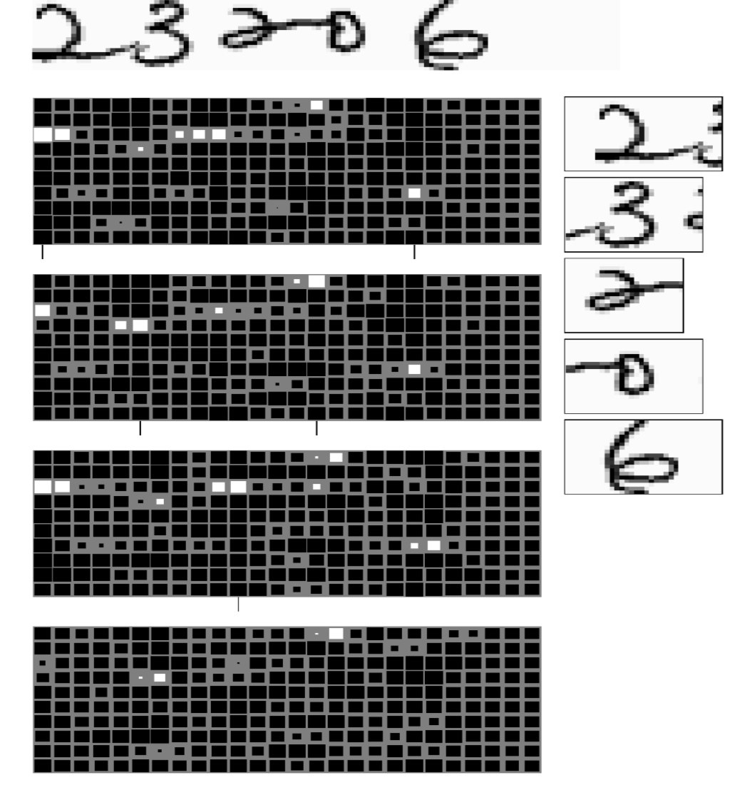

# Aplicaciones de las CNNs

## Detección de múltiples caracteres
Usar ventanas de diferentes tamaños (sliding window) y detectar elementos a lo largo de toda la imagen. (con *non-maximum supression*)
Los resultados de la red serán diferentes para cada tamaño de ventana. [Matan et al 1992]

El modelo debe poseer la opción "Ningún caracter" para detectar cambios en caracteres, y se utiliza un algoritmo de "camino más corto" para detectar el orden de los caracteres.

## Detección de caras
- Problemas:
    - Muchas cosas son no-caras =  Muchos falsos positivos.
        - Utilizar "sets negativos": Entrenar la red, hallar falsos positivos en set de pruebas y agregar las imágenes con estos falsos positivos al set de entrenamiento, reentrenar la red.
    - Las caras pueden tener múltiples tamaños
        - Es necesario escalar la imagen (for factores de $\sqrt 2$) para que las caras tengan múltiples tamaños -> un poco lento

## *Semantic segmentation*
Asignar a cada pixel de una imagen una categoría. También se necesita entrenamiento multi-escala.
- Ejemplo: regiones de una escena por las que podría andar un robot [*DARPA LAGR Project*]
## Otras cosas
- Detección de poses
- Ver cursos de computer vision para saber más jasja