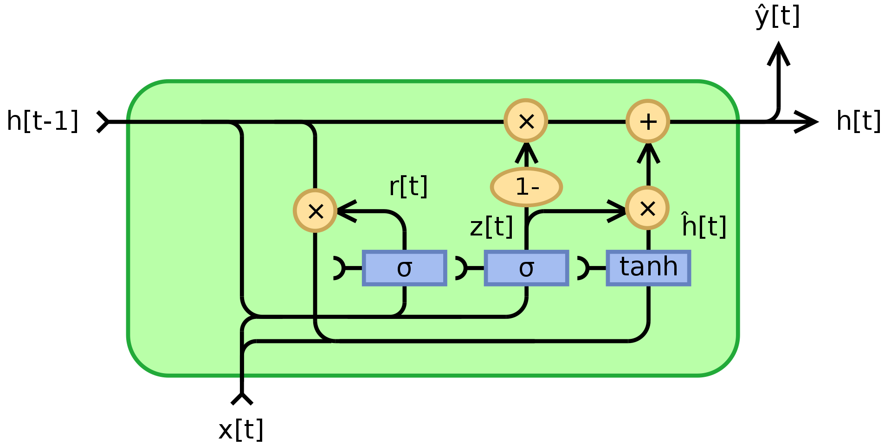
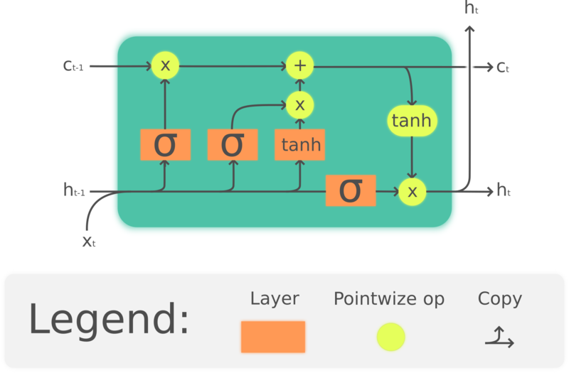
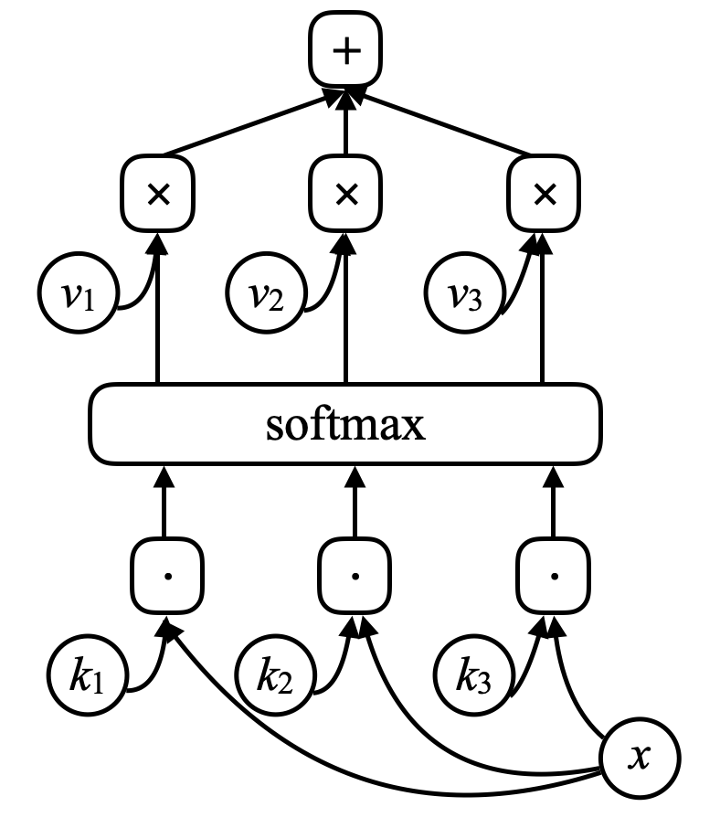

# Recurrent Neural Networks (RNN)
- *Networks with loops*: $z(t)=g(h(t),z(t-1))$
- Para hacer Backpropagation: desenrollar el ciclo en el tiempo (*unroll the loop*)
    - Backpropagation though time
    - A veces tiene problemas de *vanishing gradients*

## Módulos multiplicativos
- Módulos en los que los pesos son calculados a partir de otra matriz de pesos (u otra red neuronal)
    - *Hypernetworks*
    - *Sigma-Pi Units*
    - *Quadratic Layers*
- Módulos de atención (*Attention modules*)
    - Arquitectura especial de módulos multiplicativos
    - La salida $s$ es una representación vectorial de dos entradas $x_1$ y $x_2$, tomando a $softmax(z)$ (otro vector que puede ser salida de una red) como parámetro.
    - Esta representación también es aprendida

## Gated Recurrent Units (GRU)
- Utiliza celdas de memoria

## Long Short Term Memory (LSTM)
- También celdas de memoria

## Seq2Seq
- Se entrenó un LSTM multicapa
- Encoder -> Decoder
- Traducción entre idiomas
- Problemas:
    - LSTMs preservan información pero de forma limitada por el tamaño de la red
    - Toda la información de una frase a traducir debe ser almacenada en un solo estado (tras el encoder)
- Luego reemplazado por *Seq2Seq with attention*
- [*Attention is all you need*](https://arxiv.org/abs/1706.03762)
    - Inicio de la revolución de NLP
## Redes de memoria
- Inspiradas en la memoria humana a corto plazo

- Aprende representaciones de múltiples objetos
- Funcionan casi como un diccionario en python, pero como el sistema es diferenciable, los vectores $k,v$ son aprendibles
    - Si la entrada $x_i$, es muy similar a $k_i$, entonces la salida será $v_i$
- Utilizado para aprender representaciones de lenguaje
    - Responder preguntas
    - Completar historias
- Investigar *Neural Turing Computer*
---
- RNNs se utilizaban para NLP y reconocimiento de voz (*speech*)
    - *Speech recognition* se está moviendo hacia CNNs
    - NLP/NLU se está moviendo hacia Transformers (Memoria + Atención)
