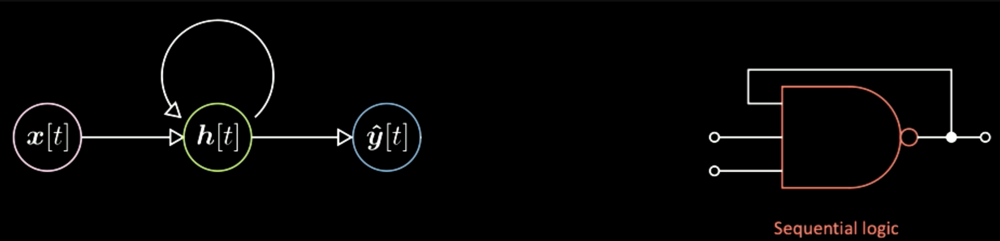
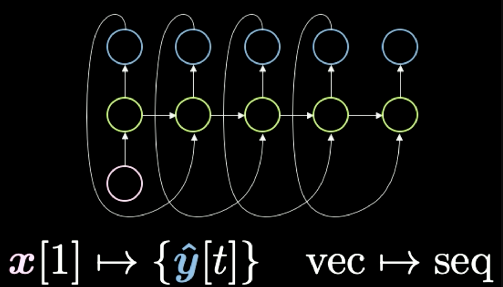
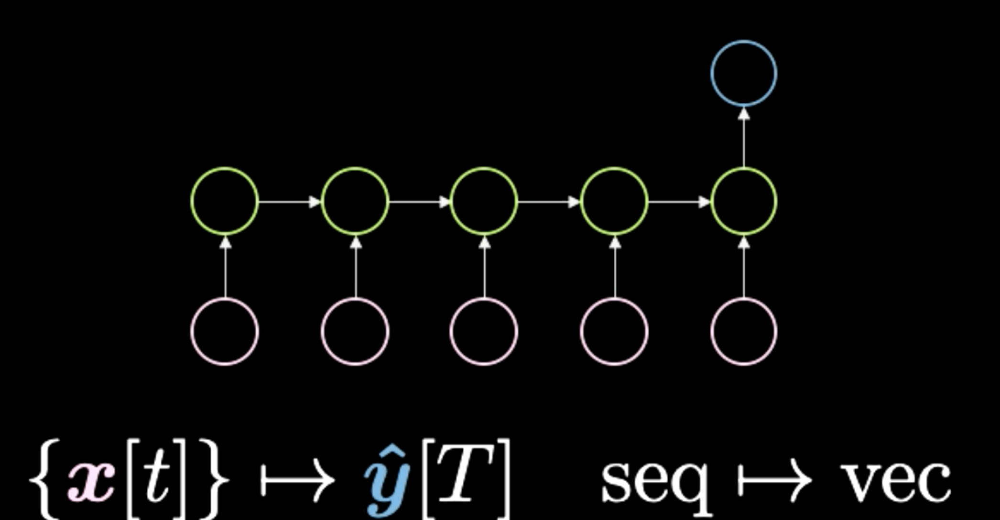
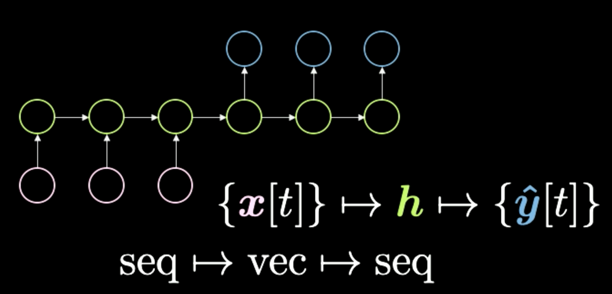
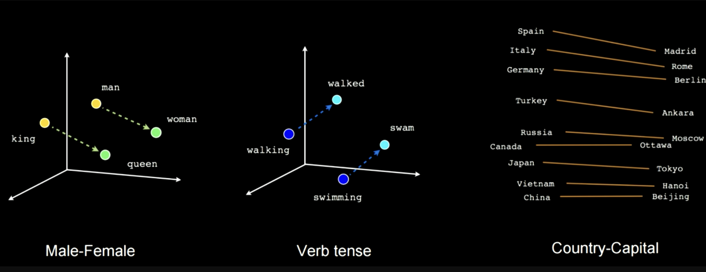
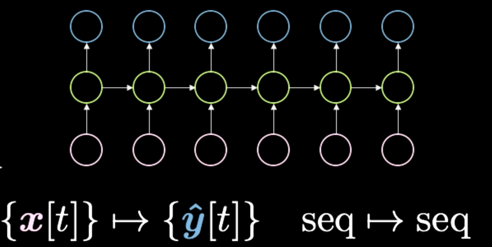
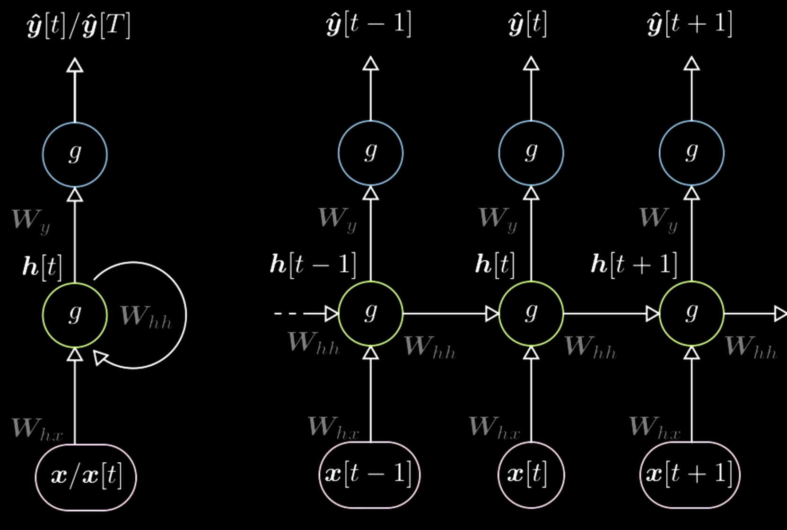

# Recurrent Neural Networks (RNN)
- *Networks with loops*: $z(t)=g(h(t),z(t-1))$
- Para hacer Backpropagation: desenrollar el ciclo en el tiempo (*unroll the loop*)
    - Backpropagation though time
    - A veces tiene problemas de *vanishing gradients*
- Alternativas que solucionan algunos problemas:
    - Gated Recurrent Units (GRU)
    - Long Short Term Memory (LSTM)
    - Utilizan celdas de memoria

## Módulos multiplicativos
- Módulos en los que los pesos son calculados a partir de otra matriz de pesos (u otra red neuronal)
    - *Hypernetworks*
    - *Sigma-Pi Units*
    - *Quadratic Layers*
- Módulos de atención (*Attention modules*)
    - Arquitectura especial de módulos multiplicativos
    - La salida $s$ es una representación vectorial de dos entradas $x_1$ y $x_2$, tomando a $softmax(z)$ (otro vector que puede ser salida de una red) como parámetro.
    - Esta representación también es aprendida

## Seq2Seq
- Se entrenó un LSTM multicapa
- Encoder -> Decoder
- Traducción entre idiomas
- Problemas:
    - LSTMs preservan información pero de forma limitada por el tamaño de la red
    - Toda la información de una frase a traducir debe ser almacenada en un solo estado (tras el encoder)
- Luego reemplazado por *Seq2Seq with attention*
- [*Attention is all you need*](https://arxiv.org/abs/1706.03762)
    - Inicio de la revolución de NLP
## Redes de memoria
- Inspiradas en la memoria humana a corto plazo

- Aprende representaciones de múltiples objetos
- Funcionan casi como un diccionario en python, pero como el sistema es diferenciable, los vectores $k,v$ son aprendibles
    - Si la entrada $x_i$, es muy similar a $k_i$, entonces la salida será $v_i$
- Utilizado para aprender representaciones de lenguaje
    - Responder preguntas
    - Completar historias
- Investigar *Neural Turing Computer*
---
- RNNs se utilizaban para NLP y reconocimiento de voz (*speech*)
    - *Speech recognition* se está moviendo hacia CNNs
    - NLP/NLU se está moviendo hacia Transformers (Memoria + Atención)

# Clase de Alfredo
## RNNs

- Tratan con señales secuenciales
    - Principalmente señales unidimensionales (dependientes del tiempo)
- La salida de la red depende del *estado del sistema* y de la entrada actual
- Tipos de redes recurrentes
    

    - $vec \rightarrow seq$  (autorregressive): Red a la que uno le realimenta su propia salida.
        

        - ej. imagen -> sequencia de palabras (frase)
    - $seq \rightarrow vec$
        

        - ej. posible intérprete de python
    - $seq \rightarrow vec \rightarrow seq$ (encoder - decoder): aprende relaciones semánticas en texto (word2vec)
        

        - ej. forma anterior de hacer traducción (ahora transformers)
        

    - $seq \rightarrow seq$
        

        - ej. autocompletado de texto

### Entrenamiento
- Backpropagation Through Time (BPTT)
- Se *desenrolla* el backprop a través del tiempo
    - Hay una bandera para parar la computación del gradiente
    - Los pesos son compartidos a través del tiempo
    - Se pueden representar pesos distintos para la entrada y para el estado

Donde,
$$h[t]=g(W_h[x[t],h[t-1]]+b_h)\\W_h=[W_{hx},W_{hh}]\\\hat y[t]=g(W_yh[t]+b_y)$$

- Para evitar *vanishing gradients*:
    - LSTM
## Long Short Term Memory (LSTM)
- *Gated RNN*
- Compuestas por
    - Memoria
    - Compuertas
    - Entradas
        - Input
        - State
    - Todos los componentes son *controlables* por la red

## Notebooks vistos
- 08-seq_classification.ipynb
- 09-echo-data.ipynb