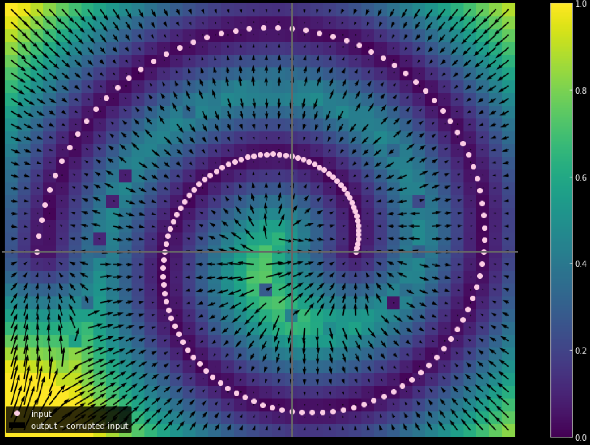

# Self-supervised learning
*Predict everything from everything else*
- Yann dice que es el futuro de Deep Learning y AI :o
- Sistema que aprenda buenas representaciones de la entrada, para con esta nueva representación realizar una tarea diferente ("auto-supervisada")
    - "Llenar los espacios en blanco"
        - En video:
            - Trayectorias
            - Objetos o partes del *frame* que son escondidos
            - Siguientes marcos de un video a partir de los anteriores
- Ha tenido mucho éxito en texto:
    - Denoising autoencoders (Transformers)
- Para video:
    - http://chengao.vision/FGVC/ :o
    - El mundo (a esta escala) es estocástico
        - Hay muchas posibles futuras continuaciones para un video
        - Una red predictiva "normal", daría como resultado el *promedio* de todas las posibilidades futuras
        - Solución: Variables latentes! (escoja una posibilidad a partir de ciertos parámetros)
- Aplicaciones
    - Cosas generativas
        - Texto
        - Imagen
        - Video
    - Control
        - Policy learning
        - Model-based RL
    - Modelos predictivos en general

## Capacidades de los modelos generativos
- Generación de caras falsas
    - 

    - https://thispersondoesnotexist.com/
    - StyleGAN2 (Karras 2019)
    - El modelo está entrenado para "aprender" caras, no fondos
    - Las caras tienen aproximadamente 50 grados de libertad
        - una función (*manifold*) de 50 dimensiones
- Fusión de representaciones
    - Animorphs
    - Transformaciones pueden ser parametrizadas por variables latentes
    - Natural image synthesis (Brock 2018)
    - Interpolación en el espacio latente de las cosas (fusión de objetos/animales)
        - Es diferente a interpolación en el espacio de pixeles, que solo es ir cambiando una imagen completa por otra
    - 

- Síntesis de imágenes
    - Versión anime xd
    - Caption-to-image (tedt to image synthesis)
    - Image inpainting (DCGAN)
    - Super-resolución (ojo con bias - Garcia 2016)
    - Transformaciones de la imagen
        - Rotación
        - Luminosidad (día/noche)
        - Ángulo

## Autoencoders
- Usando variables latentes y modelos de energía, se aprende una representación del set de entrenamiento

- $h$ es una representación intermedia del espacio latente del set de entrenamiento
- Aplicaciones
    - Compresión

- Funciones de pérdida:
$$L=\frac{1}{m}\sum_{j=1}^ml(x^{(j)},\hat x^{(j)})$$
Donde:
    - Para entradas binarias
$$l(x^{(j)},\hat x^{(j)})=\textrm{binary-cross-entropy}(x^{(j)},\hat x^{(j)})$$
    - Para entradas que toman valores reales
$$l(x^{(j)},\hat x^{(j)})=\textrm{MSE}(x^{(j)},\hat x^{(j)})$$
- Tipos de Autoencoders
    

    - Incompletos (*undercomplete*)
        - La representación intermedia es más sencilla (menos nodos en la capa) que la entrada
    - Sobrecompletos
        - Es más fácil de optimizar, puesto que la red puede encontrar representaciones más complejas (con más dimensiones). 
        - El entrenamiento es más dificil.
            - Para evitar sobreajuste
- Arquitecturas punto a punto
    - Denoising autoencoder
        

        - La distribución de ruido debe ser similar a la distribución esperada en la inferencia (en producción)
        - Los puntos de baja energía son aquellos que coinciden con el set de entrenamiento
        - Los puntos con ruido (la entrada en inferencia) se acercarán a los puntos de baja energía
        

    - Regularized autoencoder
        - Se fuerza a la red a tener representaciones "cortas"
    - Contractive autoencoder
    - Hay más...

*ver el notebook 10*